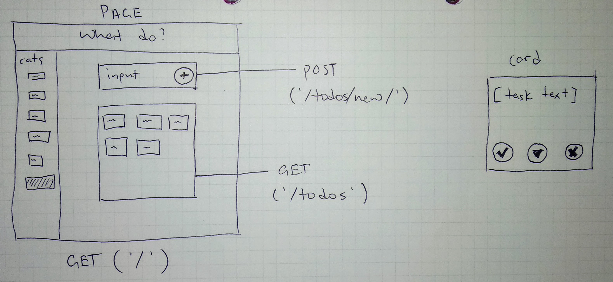
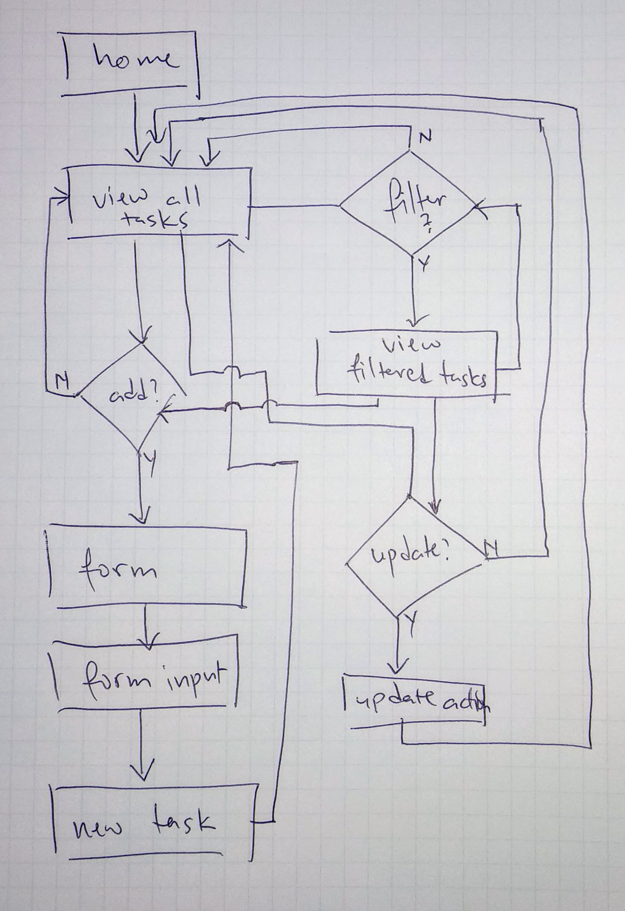

# What Do?

## Technologies

Ruby on Rails (v6.0.3.1)
Faker
Bootstrap (via NPM)
React
Axios

## Approach

### Problem - Solution
Problem: Modern todo apps have way too many bells and whistles and get fiddly
Solution: A busy, efficient, and organised person just needs somewhere to store their tasks, keep them organised, and mark things done so they can move on with life.

### User stories
``` text

As a [busy person], I want to be able to
  add task items to a list
so that
  I don't forget to do things

As an [efficient person], I want to be able to
  mark task items done
so that
  I can move on to my next task

As an [organised person], I want to be able to
  delete task items from my list
so that
  I can minimise clutter in my list

```

### Wireframe


### ERD


### User Flow


## Install
Access online on [Heroku](https://sei-whatdo.herokuapp.com)

Either of the below test users are available for playing with without signing:

|Test user | Test password |
|---|---|
|hihi | hihihi |
|koko | kokoko |

## Unsolved
I intended to implement a tagging system, but within the available time to me decided that it was a less valuable in an MVP than the CRUD functionality I built.

## Credits

- Sophia Bell for [a great guide to getting jQuery on Rails 6](https://blog.makersacademy.com/how-to-install-bootstrap-and-jquery-on-rails-6-da6e810c1b87)

- Juan Burgos for [a lovely photo](https://unsplash.com/photos/_Te_aXfSQ0Y)
